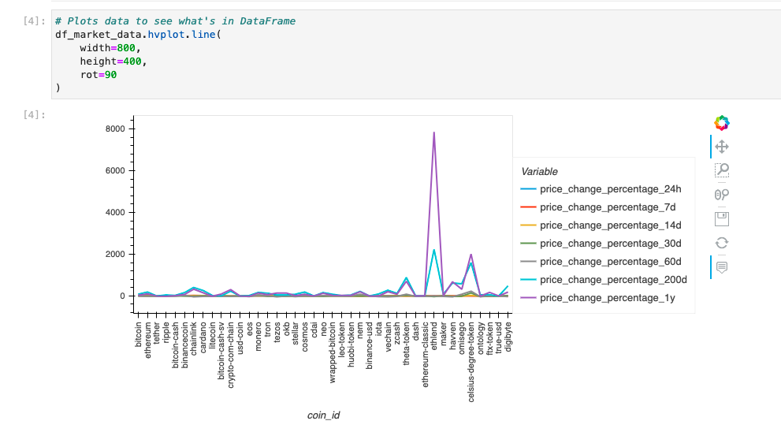
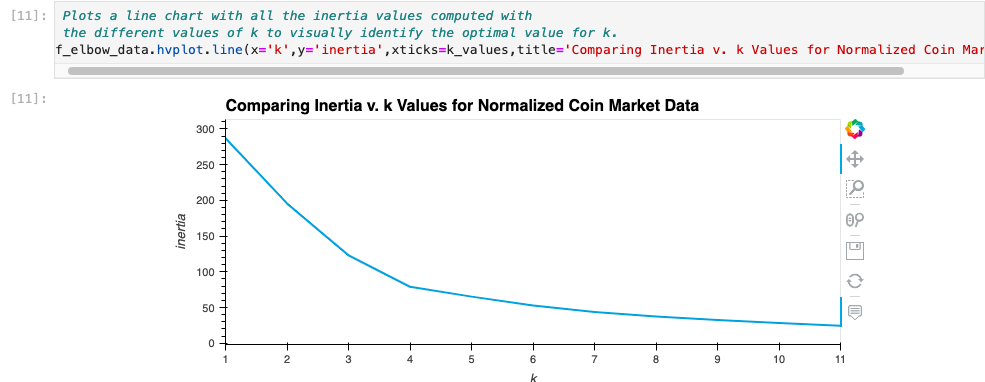
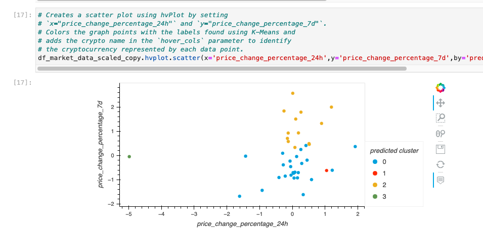
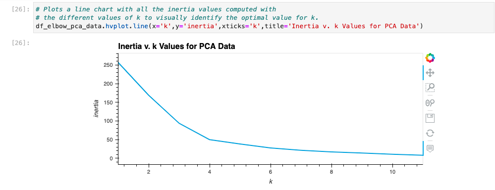
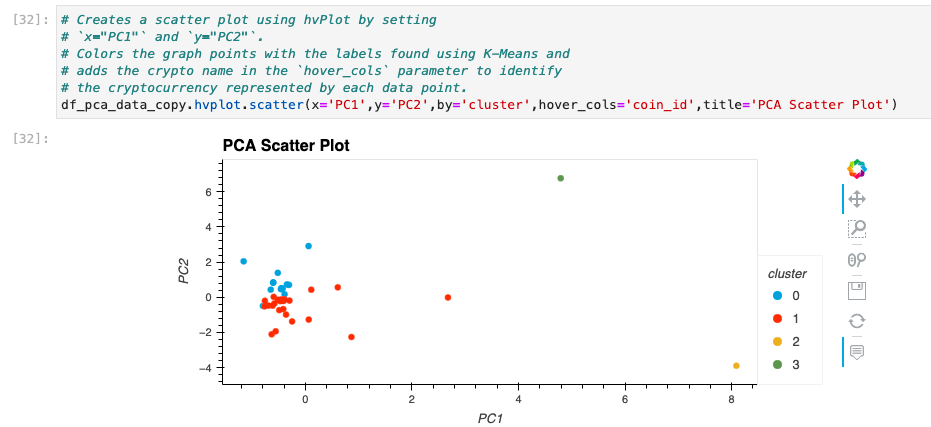
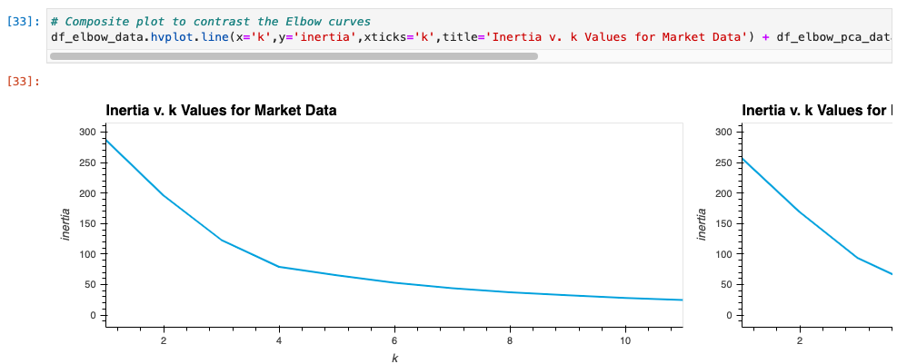
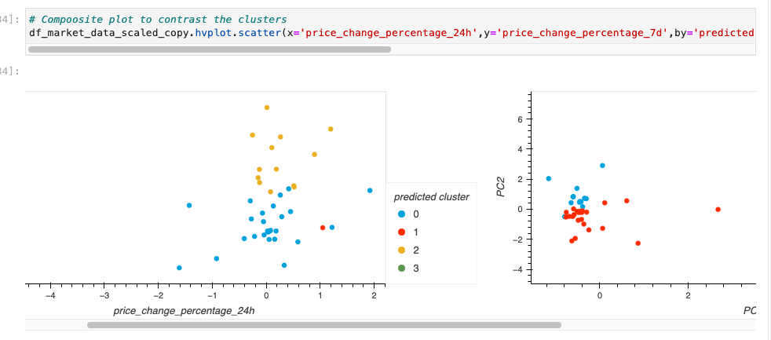

# Crypto_Unsupervised_Learning_Analysis
A comparative analysis using unsupervised learning to cluster and categorize many different crypto currencies with and without utilizing principal component analysis.

---

## Technologies

This application is written in Python v. 3.9.7 and uses [JupyterLab](https://jupyter.org/) to deploy the code. This application makes use of
 the following libraries:

[pathlib](https://docs.python.org/3/library/pathlib.html) was used to help import the csv file data

[pandas](https://pandas.pydata.org/docs/) was used for data collection, preparation, and analysis.

[hvplot](https://hvplot.holoviz.org/) was used to plot and visualize various data from the portfolio

[sklearn](https://scikit-learn.org/stable/) was used for dimensionality reduction, KMeans algrotithm modeling, and clustering


---

## Installation Guide

Prior to running this application, perform the following in the command line to install the required libraries:

`pip install pathlib`

`pip install pandas`

`pip install jupyterlab`

`pip install hvplot`

`pip install sklearn`


---

## Usage

In order to launch the application, navigate to the Crypto_Unsupervised_Learning_Analysis folder that contains all of the code for this application, and then type into the command line:

```
jupyter lab
```

Once in jupyter lab, open the crypto_investments.ipynb file and run each cell in the jupyter file to see the resulting anlysis.

Below are the outputs of the plots that were made using hvplot:









---

## Contributors

Robby Odum

Email: rodum012@gmail.com

---

## License

MIT